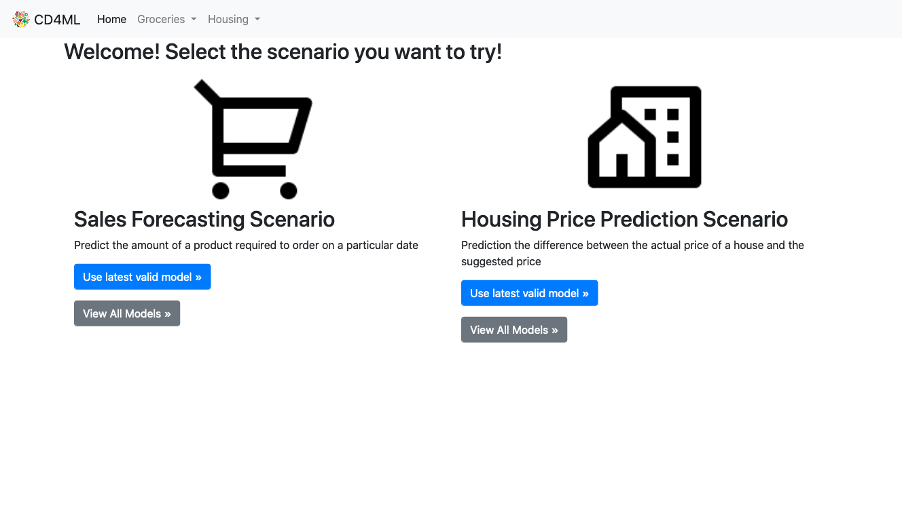
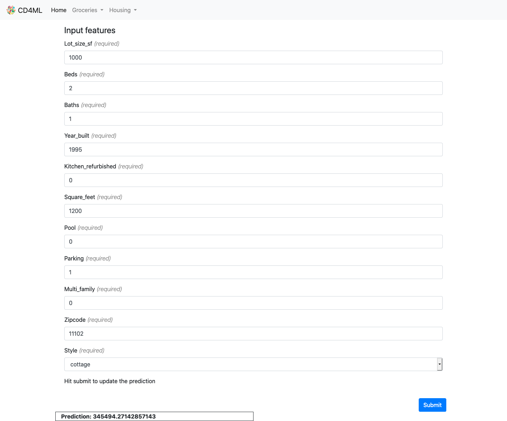
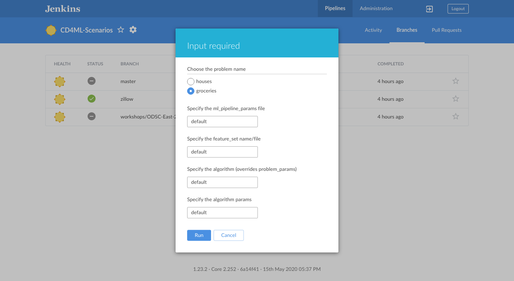

## Setting up Jenkins

## Goals

* Learn about [Jenkins](https://jenkins.io/)
* Setup and Configure a [Deployment Pipeline](https://martinfowler.com/bliki/DeploymentPipeline.html) to build and deploy your application to production
* Deploy to the Model server running in production

Navigate to [Jenkins](http://localhost:10000/blue). After you log in you will be presented with the Jenkins Blue Ocean welcome page.
 

Select "Create a Pipeline".

Click "GitHub".

Enter your Github Personal Access Token.

Select your github account, then cd4ml-scenarios and click "Create Pipeline"

At this step the pipeline will build, you can select the pipeline to see the individual steps execute. Jenkins will first index branches, [which can take time](https://support.cloudbees.com/hc/en-us/articles/360055870591-Multibranch-Pipeline-Branch-indexing-job-stuck-and-cannot-be-aborted). It will then checkout the code which [can also take a while](https://stackoverflow.com/questions/36017253/jenkins-git-fetch-timeout). It does get there eventually. At the end the pipeline should run and be 'green' indicating that all the steps were successful (shown below). If it times out then trigger a manual run.

Now, we can verify that our model works in production. Navigate to the ML Model [here](http://localhost:11000). You should see the following welcome page.

Click "Use latest valid model" in the Housing Price Prediction Scenario". From here you should be able to fill fields (see sample below) and click "Submit". Afterwards, you will see the estimated sale price of the house.

Finally, if you want to build the model for the sales forecasting scenario, navigate back to Jenkins, click Branches and then the play button next to the 'master' branch.  You should see the following window.

From here you can select the scenario that you want to execute by selecting the problem name of interest at the top. You can click 'Run' to execute the pipeline.

Now, you are ready to get started. You can continue the [Zillow Housing Scenario](./housing/3-MachineLearning.md) (recommended to start here) or the [Shopping Scenario](./groceries/3-MachineLearning.md).